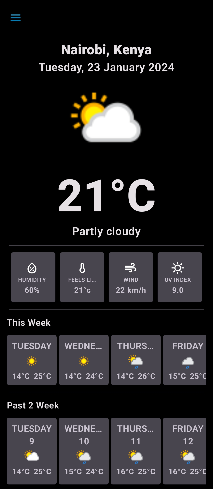
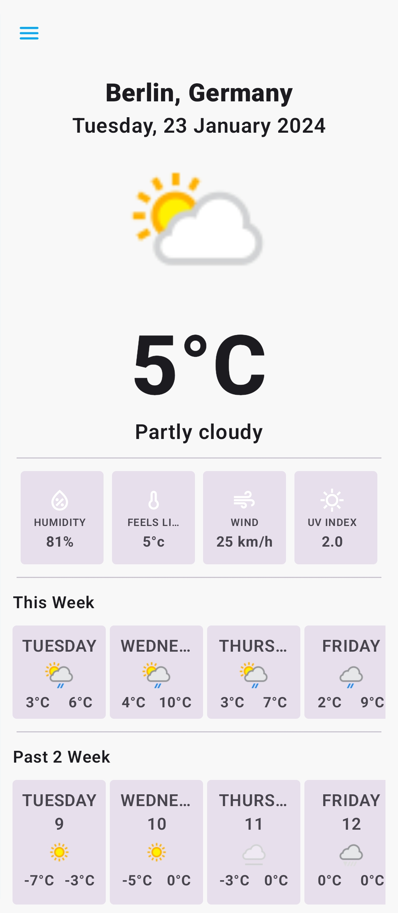

# WeatherAPI Android
 
An android app built using Kotlin that consumes [Weather API](https://app.swaggerhub.com/apis-docs/WeatherAPI.com/WeatherAPI/1.0.2) to get current day, one week and past two weeks weather forecast.
The application also supports Kotlin Multiplatform by sharing logic code.

## Prerequisite

To run the app from Android Studio on your local machine you'll need to add `api_key` value in your `local.properties` file

The API key can be generated from this [link](https://www.weatherapi.com/login.aspx).

```local.properties
api_key = <YOUR_API_KEY>
```

# Architecture
The app has two modules; `shared` and `app`.

The app module has Jetpack compose components involved in displaying information to the user and android specific code. The main part of this layer are the composables(activity and screens) and viewmodels.

The shared module has shared logic to fetch weather information from network source, cache key-value pairs and mapping data transfer object(DTOs) to domain data classes. The shared module has 3 main packages:

- __Domain__ :This is the core of the application. The domain package code is independent of any other layers thus domain models and business logic can be independent from other layers.This means that changes in other layers will have no effect on domain layer eg. screen UI (presentation layer) or changing database (data layer) will not result in any code change in domain layer.

- __Data__: The data package has logic for selecting the proper data source between network source and cached data.

- __DI__: The DI package has a class that creates a Koin module

# Libraries
- [Koin](https://github.com/google/hilt) - Dependency Injection framework
- [Jetpack compose](https://developer.android.com/jetpack/compose) - Modern toolkitfor building native UI.
- [Coil](https://coil-kt.github.io/coil/) - Load images from network source.
- [Compose Navigation](https://developer.android.com/jetpack/compose/navigation) - Navigation to composables.
- [Ktor Client](https://ktor.io/)
- [KotlinX Serialization](https://github.com/Kotlin/kotlinx.serialization) - Serialization/Desirialization of JSON response from network.
- [Multiplatform-Settings](https://github.com/russhwolf/multiplatform-settings) - Kotlin Multiplatform library for saving simple key-value data.
- [jUnit](https://junit.org/junit4/)
- [Mockk](https://mockk.io/) - Mocking library for Kotlin.
- [Robolectric](https://robolectric.org/) - Framework used to quickly and reliably run unit tests quick using the JVM
- [KtLint](https://github.com/pinterest/ktlint) - Kotlin linter.
- [Detekt](https://github.com/detekt/detekt) - Static code analysis tool for the Kotlin programming language

This projects uses [GitHub actions](https://github.com/VictorKabata/WeatherAPI-Android/actions) to run a build, execute all tests and deploy the application with Firebase app distribution.

# Screenshots
 

